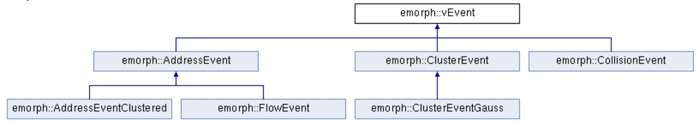
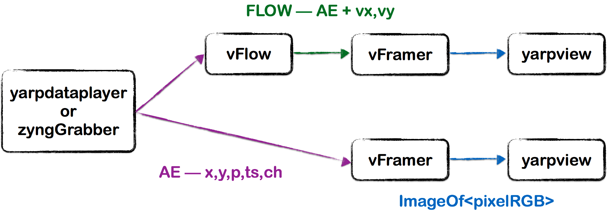

# Tutorial on Handling Event Driven Data Stream -- Optical Flow
This tutorial introduces additional functionalities of the event-driven library. We will use an example application, the **event-driven optical flow**.

# Requirements:
By now you should know the basics of event-driven library (from [tutorial_event-driven-handling](https://github.com/vvv-school/tutorial_event-handling)).


### Further event inheritance
As in the previous tutorial, different types of events can be defined, inheriting from the basic type **vEvent** that holds the _timestamp_ of the event. We can then create other types of events in a heirarchy that further adds information:




A new event type can add information to the current event, or a completely new event can be generated by a module:

- ADDRESSEVENT (AE)  - you should know by now....
- FLOWEVENT     - adds dx/dt and dy/dt
- CLUSTER EVENT - if a cluster is detected creates a new event with x,y of the cluster centre of mass, vx, vy, m (number of events forming the cluster)

Therefore:
```
event<FlowEvent> v;

getas<AddressEvent>(v); //valid
getas<vEvent>(v);       //valid
```

### vtsHelper

Timestamps are stored with (at the moment) 24 bits (unsigned integer) and the clock performing timestamps has a period of 80 nanoseconds.
If we do the maths we will overflow every: 2^24 * 80e-9 = 1.34217728 seconds. Therefore our code needs to handle overflows ("timestamp wraps").

##### You'll need this for your assignments!: 
As we often only need relative time between events, we can account for wraps using:

```javascript
event<> v; //allocated somewhere

int currenttimestamp = v->getStamp();
int previoustimestamp;    //allocated previously
if(previoustimstamp > currenttimestamp) //assuming events are in chronological order this indicates a wrap
    previoustimestamp -= vtsHelper::getMaxStamp();
int dt = currenttimestamp - previoustimestamp;
```

Alternatively the vtsHelper can be used to convert timestamps to a  long unsigned int (many years before an overflow):

```javascript
vtsHelper unwrap;
event<> v;
unsigned long int unwrappedstamp = unwrap(v->getStamp());
```

##### NOTE: We don't send the unwrapped timestamps in bottles so every module needs to track its own unwrapped timestamp

### vSurface

The optical flow tutorial uses a helper data structure to store a 


We'll start the tutorial making a system as:




